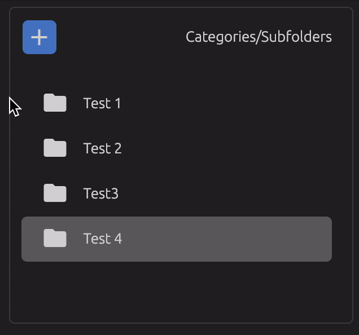

# smart-hoverjs
Smart hover WebComponent inspired on iPad OS contextual cursor.

# Install
`npm -i smart-hoverjs`

# Import
To use the web component simply import it in your main or app file like so:

```javascript
import './node_modules/smart-hoverjs'
```

Or include it in your index.html file

```javascript
<script src="./node_modules/smart-hoverjs/dist/index.js">
```

# Use

Smart hover component behaves as a regular div container, except it takes a query parameter attribute which lets the container know which children to consider 'hoverable'.

```html
<smart-hover class="category-list" query-selector=".category-list-item">
  <div class="category-list-item">Test 1</div>
  <div class="category-list-item">Test 2</div>
  <div class="category-list-item">Test 3</div>
  <div class="category-list-item">Test 4</div>
</smart-hover>
```

Smart hover component will automatically position itself on top of the elements that where found with the query selector when they are hovered, automatically adapting to their position and size.
<p style="text-align: center; width: 100%">
  
</p> 
